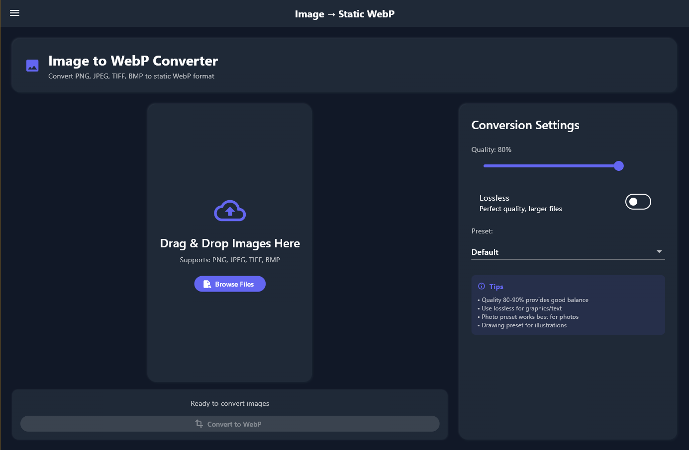

# WebP Studio

A modern Flutter desktop application for converting between PNG, GIF, and WebP formats with a beautiful neumorphic dark theme. Built as a user-friendly frontend for Google's official WebP tools.


## 📸 Screenshots

### PNG to Animated WebP Conversion

*Clean drag & drop interface for converting PNG sequences to animated WebP files*

### Static Image to WebP Conversion  

*Professional conversion tools with quality control and preset options*

## ✨ Features

### 🎯 **Core Functionality**
- **PNG → Animated WebP**: Convert image sequences to optimized animations
- **Image → Static WebP**: Convert PNG, JPEG, TIFF, BMP to WebP format
- **WebP → PNG/JPEG**: Decode WebP files back to standard formats
- **GIF → WebP**: Convert legacy GIF animations to modern WebP
- **Animation Tools**: Extract frames, compare animations, and analyze files

### 🎨 **User Experience**
- **Modern Neumorphic UI**: Beautiful dark theme with clay-style containers
- **Drag & Drop Interface**: Simply drag files into the app or click to select
- **Reorderable Image Sequences**: Easily change frame order with drag handles
- **Real-time Progress**: Live progress tracking with elegant spinning indicators
- **Responsive Design**: Scales uniformly across different window sizes

### ⚙️ **Advanced Settings**
- **Frame Rate Control**: 1-60 FPS with precision timing
- **Quality Control**: 1-100% with lossless option
- **Loop Count**: Infinite or specific repeat counts
- **Animation Effects**: Disposal methods and transparency handling
- **Batch Processing**: Handle multiple files efficiently

## 📋 System Requirements

- **OS**: Windows 10/11 (64-bit)
- **RAM**: Minimum 4GB (8GB+ recommended)
- **CPU**: Multi-core processor recommended
- **Dependencies**: Google WebP tools (included in releases)

## 🚀 Quick Start

### Option 1: Download Release (Recommended)
1. Go to [Releases](../../releases)
2. Download the latest `WebP-Master-Toolkit-vX.X.X.zip`
3. Extract to your desired location
4. Run `webp_maker.exe`

### Option 2: Build from Source
```bash
# Prerequisites: Flutter SDK, Visual Studio with C++ tools

# Clone repository
git clone [https://github.com/Whitestagconcepts/webp-studio.git]
cd webp-studio

# Install dependencies
flutter pub get

# Enable Windows desktop
flutter config --enable-windows-desktop

# Build release
flutter build windows --release
```

## 📖 Usage Guide

### Basic Workflow
1. **Select Tool**: Choose from 5 conversion tools in the sidebar
2. **Add Files**: Drag & drop or click to select your images
3. **Configure Settings**: Adjust quality, frame rate, and effects
4. **Convert**: Click convert and watch the progress
5. **Download**: Save your optimized WebP files

### Pro Tips
- **Frame Rate**: 15-30 FPS for smooth web animations
- **Quality**: 80-90% balances file size and visual quality
- **Disposal Method**: Enable "Don't Stack" for transparent backgrounds
- **Batch Processing**: Select multiple files for efficient conversion

## 🛠️ Technical Details

**Built with:**
- [Flutter](https://flutter.dev) - Cross-platform UI framework
- [Google WebP Tools](https://developers.google.com/speed/webp) - Official WebP codec
- [Provider](https://pub.dev/packages/provider) - State management
- [Clay Containers](https://pub.dev/packages/clay_containers) - Neumorphic design

**Architecture:**
- Frontend: Flutter desktop application
- Backend: Google's `cwebp`, `dwebp`, `img2webp`, `webpmux` tools
- State Management: Provider pattern with reactive UI updates

## 🤝 Contributing

Contributions are welcome! Please feel free to submit a Pull Request.

1. Fork the repository
2. Create your feature branch (`git checkout -b feature/AmazingFeature`)
3. Commit your changes (`git commit -m 'Add some AmazingFeature'`)
4. Push to the branch (`git push origin feature/AmazingFeature`)
5. Open a Pull Request

## ☕ Support Development

If this tool has been helpful, consider supporting its development:

- ⭐ Star this repository
- 🐛 Report bugs and request features
- ☕ [Buy me a coffee](https://www.paypal.com/donate/?hosted_button_id=KQNYW5QMJU82Q)

## 📄 License

This project is licensed under the MIT License - see the [LICENSE](LICENSE) file for details.

## 🙏 Acknowledgments

- **Google WebP Team** - For the excellent WebP format and tools
- **Flutter Team** - For the amazing cross-platform framework
- **Contributors** - Thank you to everyone who helps improve this project

## 📞 Support

- 🐛 **Bug Reports**: [Open an issue](../../issues)
- 💡 **Feature Requests**: [Start a discussion](../../discussions)
- 📧 **Contact**: joey@whitestagconcepts.com

---

**Powered by Google WebP Tools** | **Made with ❤️ using Flutter**
